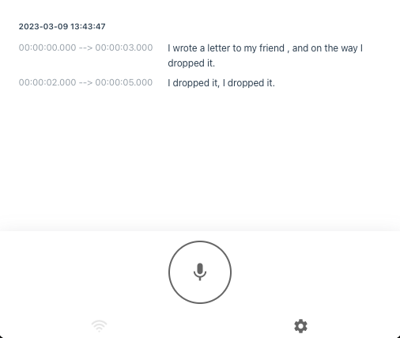
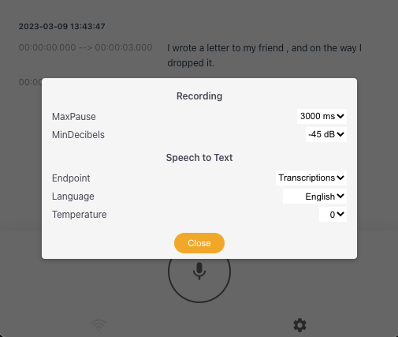

openai-whisper-api
====

This is a sample speech transcription web application implementing `OpenAI` [Speech to Text API](https://platform.openai.com/docs/guides/speech-to-text) based on [Whisper](https://openai.com/research/whisper), an automatic speech recognition (ASR) system, built using [Next 13](https://nextjs.org/), the `React` framework.

以下は、OpenAIテキスト読み上げAPIを実装したサンプルスピーチ転写アプリです。このアプリは、自動音声認識（ASR）システムのWhisperに基づいて構築され、ReactフレームワークのNext 13を使用しています。

> **Update:** Added [code to trim the silent parts of the audio file](#using-ffmpeg-to-trim-audio-file) and [Safari and mobile recording should now be fixed](#known-issues).

> **Update:** Now using [v4.20 OpenAI Node module](https://www.npmjs.com/package/openai)

> **Update:** I added support using the python module instead of the whisper API so that you can use whisper without OpenAI account. See [python module installation](#installing-whisper-python-module) section for more details.

---

For other versions, please check:
- [openai-whisper](https://github.com/supershaneski/openai-whisper), using the `Whisper` python module, no remote API call, built on `Next.js`
- [openai-chatterbox](https://github.com/supershaneski/openai-chatterbox), same as above but built using `Nuxt.js`
- [openai-whisper-talk](https://github.com/supershaneski/openai-whisper-talk), combines `Text completion endpoint` and `Whisper` python module to bring full voice chat with AI, built using `Nuxt.js`.

# Table of Contents

- [openai-whisper-api](#openai-whisper-api)
- [Table of Contents](#table-of-contents)
- [Usage](#usage)
- [Known Issues](#known-issues)
- [Speed Test](#speed-test)
- [Stack](#stack)
- [Next 13 Route Handler + File Upload](#next-13-route-handler--file-upload)
- [Using FFMPEG To Trim Audio File](#using-ffmpeg-to-trim-audio-file)
- [Speech To Text](#speech-to-text)
- [Installing Whisper Python module](#installing-whisper-python-module)
- [Installation](#installation)
- [Using HTTPS](#using-https)

# Usage



**Please note that you can choose to use either the `whisper python module` which does not need OpenAI API Key or `whisper API` which needs a working `OpenAI API Key` to run this application . See the [installation](#installation) procedure below.**

Run the app and click the Start button.

Recording will only start if voice or sound is detected. You can control the detection sensitivity by adjusting the [minDecibels](https://developer.mozilla.org/en-US/docs/Web/API/AnalyserNode/minDecibels) value. Lower value means more soft sounds are detected. Note that the values are in negatives.

If sound is not detected for 3 seconds, recording will stop and the audio data is sent to the backend for transcribing. In normal speech, it is said that the people tend to pause, on average, [around 2 seconds between sentences](https://mannerofspeaking.org/2019/11/12/pauses-in-a-speech-why-when-and-how/). You can also control the maximum time to wait for pause by adjusting the `maxPause` value.



If the audio data does not contain any text data, it will be disregarded.

The transcription data will be saved in the localStorage for easy retrieval.
You can verify the accuracy of the transcription/translation by playing the saved audio data associated with the transcription/translation.


It is possible to delete the transcription item. Hover on a transcription to show the delete button and press the icon to show a dialog box to confirm.

> TODO: save the transcription to file

# Known Issues

- **Fixed**. Using **desktop Safari** and **mobile Safari** should now be okay. Chrome should have no problem. The fix is the unintended consequence of adding [audio trimming](#using-ffmpeg-to-trim-audio-file).

- **Fixed**. If `minDecibels` values is the same as `maxDecibels`, it will throw an error `INDEX_SIZE_ERR`. The default value of `maxDecibels` is -30dB. I added `maxDecibels` in the code to handle this.

- If you set `minDecibels` to very low values (-60dB to -70dB), recording can be triggered by faint noises and the resulting audio data may not be discernible to the API and it can throw 400 Bad Request.

# Speed Test

Using whisper-api

**Audio data**

- [Damian Lewis as Antony in Julius Caesar via Guardian Culture](https://youtu.be/q89MLuLSJgk)
- URL: https://youtu.be/q89MLuLSJgk
- Duration: 02:33

I selected this because there is no overpowering background music.

**App settings**

- MaxPause: 2500ms
- MinDecibels: -60dB
- Transcriptions
- Language: English
- Temperature: 0

MaxPause setting will cause the transcription to be divided into 3 files.

Audio data is saved as webm.

**Result**

1st part
- File size: 693KB
- Duration: 01:03
- Process time: 4s

2nd part
- File size: 808KB
- Duration: 01:00
- Process time: 4s

3rd part
- File size: 462KB
- Duration: 00:29
- Process time: 2s

`Process time` is the time from sending the audio data to the back end and finally getting result from whisper API.


# Stack

- [Next 13](https://nextjs.org/docs), React framework, the current latest version, with `app` directory.
  
  Using manual installation

  ```sh
  npm install next@latest react@latest react-dom@latest eslint-config-next@latest
  ```

  See [docs](https://beta.nextjs.org/docs/installation) for further instructions.

- [Storybook](https://storybook.js.org/blog/integrate-nextjs-and-storybook-automatically/), tool for UI development, **zero-config** support for Next 13 ( _look ma', no hands 🖐!_ ).

    Go to your project directory and run

    ```sh
    npx storybook@next init
    ```

- [Zustand](https://github.com/pmndrs/zustand), app state management solution using simplified flux principles. Specifically, I will be using the [persisting store middleware](https://docs.pmnd.rs/zustand/integrations/persisting-store-data).

  ```sh
  npm install zustand
  ```

- [Speech to Text API](https://platform.openai.com/docs/guides/speech-to-text), OpenAI speech to text API based on the state-of-the-art open source large-v2 `Whisper` model.
  
  You will need an `OpenAI API key` to use this API endpoint. 
  
  If you have not yet done so, upon signing up an OpenAI account, you will be given `$18 in free credit that can be used during your first 3 months`. Visit the [OpenAI website](https://platform.openai.com/) for more details.

- [Whisper Python module](https://github.com/openai/whisper), python module to use whisper without using the API endpoint. 
  
  Install this if you do not have OpenAI account/API key or you do not want to use the `whisper API`. See the [installation procedure](#installing-whisper-python-module) below.

- [OpenAI](https://github.com/openai/openai-node), library that provides convenient access to the OpenAI API from Node.js apps. This will replace `axios` call.

  ```sh
  npm install openai
  ```

- [Form-Data](https://github.com/form-data/form-data#readme), library to create readable `multipart/form-data` streams. `Whisper API` currently only has python and curl implementations. Since [FormData](https://developer.mozilla.org/en-US/docs/Web/API/FormData/FormData) does not exist inside `route handler` so we need an alternative.

  ***Deprecation note:*** _This library is no longer used and has been superseded by the OpenAI Node.js library._

  ```sh
  npm install form-data
  ```

- [Axios](https://axios-http.com/), promise based HTTP client for the browser and node.js. As alternative to `curl`, I tried using just plain `fetch` but I was encountering problem when attaching the form data. So I will be using `axios` instead to submit request to `Whisper API` endpoint.

  ***Deprecation note:*** _This library is no longer used and has been superseded by the OpenAI Node.js library._

  ```sh
  npm install axios
  ```

# Next 13 Route Handler + File Upload

In my previous Next.js project, I was using `middleware` (multer and next-connect) to handle `file upload` to the API route. But for `Next 13` route handler, it is no longer necessary. You can read the uploaded file as `Blob` directly from the `FormData` in the request object and just save it manually.

In your route.js
```javascript
export async function POST(req) {

  const form = await req.formData()
  const blob = form.get("file")

  const buffer = Buffer.from( await blob.arrayBuffer() )

  const filename = "file" + Date.now() + Math.round(Math.random() * 100000) + ".m4a"
  const filepath = `${path.join("public", "uploads", filename)}`

  fs.writeFileSync(filepath, buffer)

  ...

}
```

However, one caveat, Next 13 gives warning:
> (node:5006) ExperimentalWarning: buffer.Blob is an experimental feature. This feature could change at any time

# Using FFMPEG To Trim Audio File

Remember the `MaxPause` setting where we wait for silence before sending the audio to the server?
Well, we probably should trim it from the audio file. In this end, we will be using **ffmpeg**. 
So it now becomes necessary [to install it](#installing-whisper-python-module).

After saving the audio file, we call the `ffmpeg` command

```javascript
const sCommand = `ffmpeg -i ${filepath} -af silenceremove=stop_periods=-1:stop_duration=1:stop_threshold=-50dB ${outFile}`
      
exec(sCommand, (error, stdout, stderr) => {
    
  if (error) {
      
    resolve({
      status: 'error',
    })

  } else {

    resolve({
      status: 'success',
      error: stderr,
      out: stdout,
    })

  }
    
})
```

If there is no error and the resulting file is more than the minimum file size, we send the audio data to whisper.

There is an unintended consequence of this code which fixes the problem of Invalid file format error in Whisper API for Safari browser (desktop and mobile).


# Speech To Text

I just replaced the API call using [OpenAI Node.js library](https://platform.openai.com/docs/api-reference/audio) from previously using `axios` to simplify everything.

```javascript
export async function whisper({
    mode = 'transcriptions',
    file,
    model = 'whisper-1',
    prompt = '',
    response_format = 'json',
    temperature = 0,
    language = 'en',
}) {

    const options = {
        file,
        model,
        prompt,
        response_format,
        temperature,
        language,
    }

    try {

        const response = mode === 'translations' ? await openai.audio.translations.create(options) : await openai.audio.transcriptions.create(options)
        
        return response

    } catch(error) {
        
        console.log(error.name, error.message)

        throw error
        
    }

}
```

I will be using this in the POST handler for the route, as shown below.

```javascript
try {

  const result = await whisper({
    file: fs.createReadStream(filepath),
    response_format: 'vtt',
    temperature: options.temperature, // e.g. 0, 0.7
    language: options.language, // e.g. en, ja
  })

  return new Response(JSON.stringify({ 
      data: result?.data,
  }), {
      status: 200,
  })
  
} catch(error) {

  console.log(error)

}
```

For this project, I need the `timestamp` of the transcription so I am using `response_format` as `vtt` file. If you use `text` file, the output will not contain any timestamp.

# Installing Whisper Python module

If you wish to use this app without OpenAI API key or without using whisper API endpoint, you need to install this.

First, you need to install [`Whisper`](https://github.com/openai/whisper) and its `Python` dependencies

```sh
$ pip install git+https://github.com/openai/whisper.git
```

You also need `ffmpeg` installed on your system

```sh
# macos
$ brew install ffmpeg

# windows using chocolatey
$ choco install ffmpeg

# windows using scoop
$ scoop install ffmpeg
```

By this time, you can test `Whisper` using command line

```sh
$ whisper myaudiofile.ogg --language English --task translate
```

You can find sample audio files for testing from [here](https://commons.wikimedia.org/wiki/Category:Audio_files_of_speeches).


If that is successful, continue to the installation procedures below.


# Installation

**Important:** Be sure to [install ***ffmpeg***](#using-ffmpeg-to-trim-audio-file) in your system before running this app. See previous section.

Clone the repository and install the dependencies

```sh
git clone https://github.com/supershaneski/openai-whisper-api.git myproject

cd myproject

npm install
```

Create a `.env` file in the root directory and copy the contents of `.env.example` and replace the value of `OPENAI_APIKEY` with your own.

```sh
OPENAI_APIKEY=PUT_YOUR_OPENAI_API_KEY
DO_NOT_USE_API=false
```

If you have not yet registered in OpenAI, please note that upon signing up you will be given `$18 in free credit that can be used during your first 3 months`. Visit the [OpenAI website](https://platform.openai.com/) for more details.

If you do not want to use `Whisper API`, just set `DO_NOT_USE_API` to TRUE. Be sure to [install the python module](#installing-whisper-python-module) first.

```sh
OPENAI_APIKEY=PUT_YOUR_OPENAI_API_KEY
DO_NOT_USE_API=true
```

Finally, to run the app

```sh
npm run dev
```

Open your browser to `http://localhost:3005/` to load the application page.
Please note that the `port number` is subject to the availability and may change.

> Note: You can only capture audio data using `http` in `localhost`.


# Using HTTPS

You might want to use a remote computer or any remote device connected to your network to run this app. In that case, you will need to run it in `https` so that we can capture audio data.

Prepare the proper `certificate` and `key` files and put it in the root directory and edit `server.js` file, also located in the root directory.

In `server.js`
```javascript

const httpsOptions = {
    key: fs.readFileSync('./KEY.pem'),
    cert: fs.readFileSync('./CERT.pem')
}

```

You also need to provide your local `hostname` and `port` in `server.js` since Next.js now [requires absolute path starting from version 13](https://nextjs.org/docs/messages/middleware-relative-urls).

In `server.js`
```javascript

const hostname = '192.168.0.1'
const port = 3006

const app = next({ dev, hostname, port })

```

Then run

```sh
node server.js
```

Finally, open your browser to `https://localhost:3006/` or use your local hostname `https://192.168.0.1:3006`.
